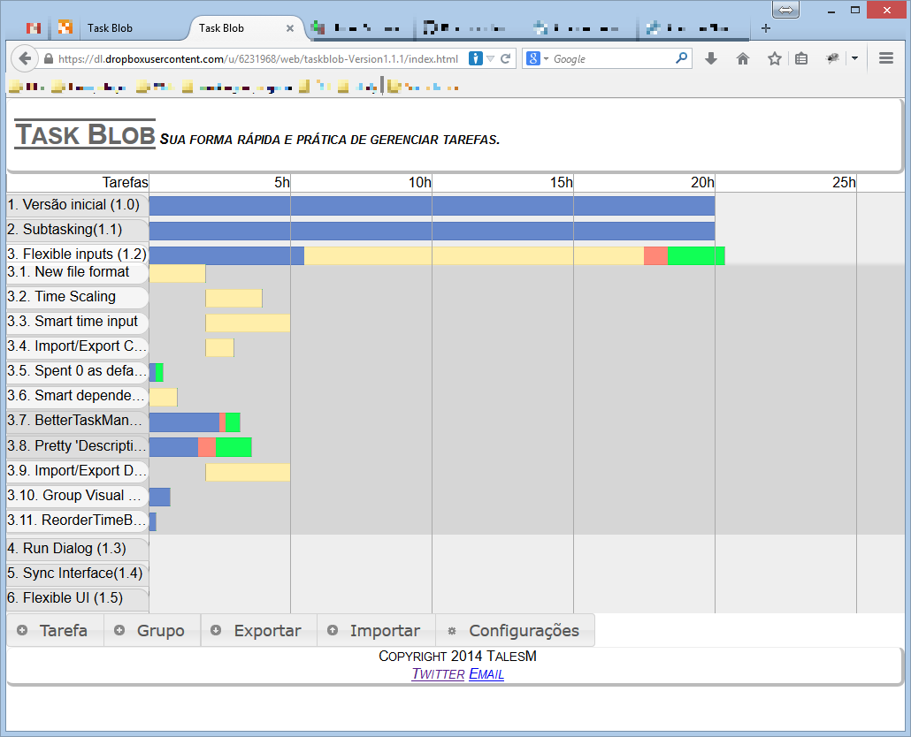

Taskblob
========

A quick and easy task manager for hobby projects. 
You don't want to have strict deadlines to a hobby, but is fun complete 
something and launch once in a while and just doing something in a "go horse" 
methodology buries you in a endless effort, as a 
*software never really is finished*. So we need to do at least some *to do* 
list of things we must do in order of priority. I, personally, find this 
solution too incomplete, because:

1. Some items will depend from each other, and just put the dependencies up 
	the list mess with our priority schema.
	
2. The list starts small and apparently simple, but soon you realizes it is too
	abstract and you have to either: 
	
	2.1. Break each item in a series of more concrete items. This will make 
		your list grow out of control and you'll probably mess up with the 
		different degrees of abstraction;
		
	2.2. Create sub lists for each item too abstract. You will end up with a 
		insane amount of to lists and probably will have problems to keep all
		of them consistent and updated.

3. Control how much you expects to work and how much you already worked can be 
	really hard, It's easy to forgot how complete is something. 

I make the assumption you don't want to have hard deadlines for a hobby, as it's 
hobby after all and making compromises withdraws all the fun, But is good know 
how much time your pet-project will cost an efficient you are being. So this 
TaskBlob **do not** have any calendar related function. All you do is create 
tasks who have an *expected* duration and the *effectively* spent time on it.
You can edit as you wish, setting dependencies, grouping subtasks, closing or 
reopening it and so on. The system will always shows the the schedule in a
Gantt chart-like visual schedule. 

The visual schedule is the most central thing in the interface, as it shows
you how much you've done, how much was remaining (or leftover) and how much
it is overdue, besides showing dependency. (must be improved, I know, but this
is my hobby project and I did not get there yet ;) )

Besides, it also do some nice things, as export/import the data (only in our 
own JSON format by now, but I plan to add more and connect with storage 
services) and you the new, but broadly supported, HTML5 Storage to you never
lost your list.

For me it is a fun and useful project, as I did for my needs, as I have a lot
of hobby projects like this and is good to have some way to organize it. Do you
believe that before it I used to-do lists annotated in paper? I hope it can be
useful to you too, and feel free to [contribute](https://github.com/TalesM/taskblob) 
(there is a roadmap somewhere in the [wiki](https://github.com/TalesM/taskblob/wiki) 
and the fork button is your friend!) and suggest features, as that 
roadmap is more an wishlist and general guideline than a rock solid planning. 

So, have fun.
